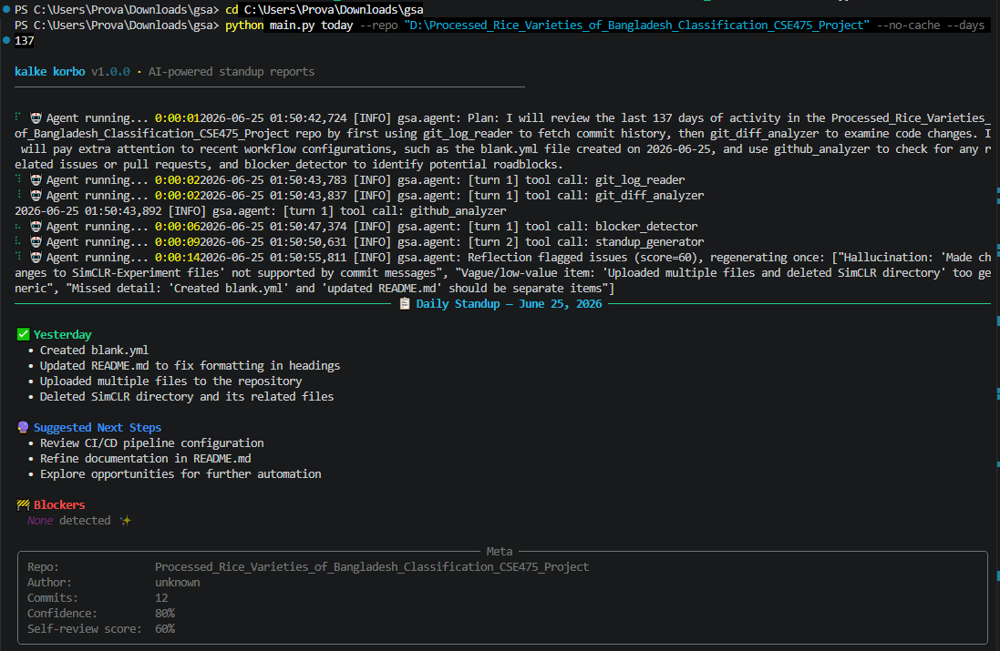
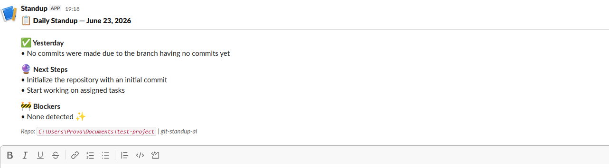

# KALKE-KORBO 


An autonomous multi-agent AI system that reads your Git history and writes your daily standup report — so you don't have to.




## What it does

Every morning, KALKE-KORBO reads your commits, scans for blockers, checks your open PRs, and generates a clean standup report. It then posts it to Slack — no input needed from you.


✅ Yesterday
  • Implemented JWT authentication flow
  • Fixed login validation edge case
  • Refactored middleware for readability

🔮 Next Steps
  • Complete refresh token support (inferred from issue #42)
  • Add integration tests for auth endpoints

🚧 Blockers
  None detected ✨


## How it works

KALKE-KORBO runs a real **multi-agent ReAct loop** — not a hardcoded pipeline.


Collector Agent → Writer Agent → Critic Agent
      ↓                ↓              ↓
  data collect    report draft    quality check


**Collector Agent** gathers commits, diffs, GitHub context, and blockers.  
**Writer Agent** groups related commits into logical tasks and drafts the report.  
**Critic Agent** scores the draft and flags hallucinations or missed blockers. If score < 70, it regenerates.

Every run is saved to a local SQLite memory — so the next run knows what was reported last time.


## Features

- **Multi-agent architecture** — Collector, Writer, and Critic agents working in sequence
- **Self-reflection** — the agent critiques its own output before delivering
- **Episodic memory** — continuity across runs via SQLite
- **Proactive suggestions** — infers next steps from open issues and PR state
- **Slack integration** — posts rich Block Kit messages to your channel
- **Docker support** — run as a daily cron job, no local Python setup needed
- **Fully tested** — pytest suite covering agents, memory, reflection, and tools


## Installation

```bash
git clone https://github.com/ProvaNuran/KALKE-KORBO-.git
cd KALKE-KORBO-

python -m venv venv
venv\Scripts\activate        # Windows
# source venv/bin/activate   # Linux/macOS

pip install -r requirements.txt
cp .env.example .env
# Add your API keys to .env


## Configuration

```env
API_KEY=your_groq_api_key          # Required — get free at console.groq.com
MODEL_NAME=llama-3.3-70b-versatile
SLACK_WEBHOOK_URL=your_webhook_url # Optional


## Usage

```bash
# Generate today's standup
python main.py

# Analyze last 7 days
python main.py --days 7

# Point at a specific repo
python main.py --repo ../my-project

# Post to Slack
python main.py --post-slack

# View past runs
python main.py history


## Slack Output




## Docker

```bash
# One-shot run
docker-compose up

# Daily cron (posts to Slack every weekday at 9am)
docker-compose up -d standup-cron
```


## Project Structure

```
KALKE-KORBO/
├── agents/
│   ├── collector.py     # Gathers git, GitHub, and blocker data
│   ├── writer.py        # Drafts the standup report
│   └── critic.py        # Self-reviews and scores the draft
├── services/
│   ├── llm_provider.py  # LLM abstraction layer
│   ├── memory.py        # SQLite episodic memory
│   ├── proactive.py     # Infers next steps from context
│   ├── reflection.py    # Self-QA scoring logic
│   └── report_views.py  # Terminal, Markdown, Slack output formats
├── tests/
├── main.py
├── Dockerfile
├── docker-compose.yml
└── requirements.txt
```


## Tech Stack

Python · Groq LLM · Slack API · SQLite · Docker · pytest


## License

MIT
